# WebAuthn (Passkeys) Authentication Flow

## What is `currentChallenge`?

A **challenge** is a random, one-time-use string generated by the server for each WebAuthn ceremony (registration or authentication). It serves as a **cryptographic nonce** that prevents **replay attacks** — where an attacker intercepts a valid credential response and re-sends it later to impersonate the user.

### How it works

1. The server generates a unique challenge and stores it on the `User` record (`currentChallenge` column).
2. The challenge is sent to the browser as part of the options object.
3. The authenticator (fingerprint sensor, security key, etc.) **signs the challenge** with the user's private key.
4. The server verifies the signed response against the **exact challenge it stored**. If they don't match, verification fails.
5. After verification (success or failure), the server **clears** the challenge so it can never be reused.

> **In short**: `currentChallenge` is a one-time proof that the server and the authenticator are talking about the **same ceremony at the same moment in time**.

---

## Registration Flow (New Passkey)

```mermaid
sequenceDiagram
    actor User
    participant Browser
    participant Frontend as Angular Frontend
    participant Backend as NestJS Backend
    participant DB as PostgreSQL

    User->>Browser: Enter email, click "Register Passkey"
    Browser->>Frontend: registerPasskey()

    Note over Frontend,Backend: Step 1 — Generate Registration Options
    Frontend->>Backend: GET /auth/generate-registration-options?email=user@email.com
    Backend->>DB: findOrCreate(email)
    DB-->>Backend: User record
    Backend->>DB: Find existing passkeys (for excludeCredentials)
    DB-->>Backend: Passkey[]
    Backend->>Backend: generateRegistrationOptions() → creates random challenge
    Backend->>DB: UPDATE user SET currentChallenge = "abc123..."
    Backend-->>Frontend: PublicKeyCredentialCreationOptions (includes challenge)

    Note over Frontend,Browser: Step 2 — Browser Passkey Prompt
    Frontend->>Browser: startRegistration(options)
    Browser->>User: 🔐 Biometric / Security Key prompt
    User->>Browser: Approve (fingerprint, face, PIN, etc.)
    Browser->>Browser: Authenticator signs the challenge with a new key pair
    Browser-->>Frontend: RegistrationResponseJSON (signed credential)

    Note over Frontend,Backend: Step 3 — Verify & Save
    Frontend->>Backend: POST /auth/verify-registration { email, credential }
    Backend->>DB: Find user + get currentChallenge
    DB-->>Backend: User { currentChallenge: "abc123..." }
    Backend->>Backend: verifyRegistrationResponse() — checks signature against challenge
    Backend->>DB: INSERT INTO passkeys (credentialID, publicKey, counter, user)
    Backend->>DB: UPDATE user SET currentChallenge = NULL
    Backend-->>Frontend: { verified: true }
    Frontend->>Browser: Show "Passkey registered!" success message
```

---

## Authentication Flow (Login)

```mermaid
sequenceDiagram
    actor User
    participant Browser
    participant Frontend as Angular Frontend
    participant Backend as NestJS Backend
    participant DB as PostgreSQL

    User->>Browser: Enter email, click "Login with Passkey"
    Browser->>Frontend: loginWithPasskey()

    Note over Frontend,Backend: Step 1 — Generate Authentication Options
    Frontend->>Backend: GET /auth/generate-authentication-options?email=user@email.com
    Backend->>DB: findByEmail(email)
    DB-->>Backend: User record
    Backend->>DB: Find user's passkeys (for allowCredentials)
    DB-->>Backend: Passkey[]
    Backend->>Backend: generateAuthenticationOptions() → creates random challenge
    Backend->>DB: UPDATE user SET currentChallenge = "xyz789..."
    Backend-->>Frontend: PublicKeyCredentialRequestOptions (includes challenge)

    Note over Frontend,Browser: Step 2 — Browser Passkey Prompt
    Frontend->>Browser: startAuthentication(options)
    Browser->>User: 🔐 Biometric / Security Key prompt
    User->>Browser: Approve (fingerprint, face, PIN, etc.)
    Browser->>Browser: Authenticator signs the challenge with existing private key
    Browser-->>Frontend: AuthenticationResponseJSON (signed assertion)

    Note over Frontend,Backend: Step 3 — Verify & Issue JWT
    Frontend->>Backend: POST /auth/verify-authentication { email, credential }
    Backend->>DB: Find user + get currentChallenge
    DB-->>Backend: User { currentChallenge: "xyz789..." }
    Backend->>DB: Find passkey by credentialID
    DB-->>Backend: Passkey { publicKey, counter }
    Backend->>Backend: verifyAuthenticationResponse() — verify signature with stored public key
    Backend->>DB: UPDATE passkey SET counter = newCounter (replay protection)
    Backend->>DB: UPDATE user SET currentChallenge = NULL
    Backend->>Backend: jwtService.sign({ sub: user.id, email })
    Backend-->>Frontend: { accessToken: "eyJhbG..." }
    Frontend->>Browser: localStorage.setItem("token", accessToken)
    Frontend->>Browser: Navigate to /dashboard
```

---

## Why the Challenge Matters — Replay Attack Prevention

```mermaid
sequenceDiagram
    participant Attacker
    participant Server

    Note over Attacker,Server: Without a challenge (BAD)
    Attacker->>Server: Replays a previously intercepted credential response
    Server->>Server: ❌ No way to know this is a replay

    Note over Attacker,Server: With a challenge (GOOD)
    Attacker->>Server: Replays old credential response (signed with old challenge)
    Server->>Server: currentChallenge = "new_challenge_456"
    Server->>Server: ✅ Signature doesn't match current challenge → REJECTED
```

